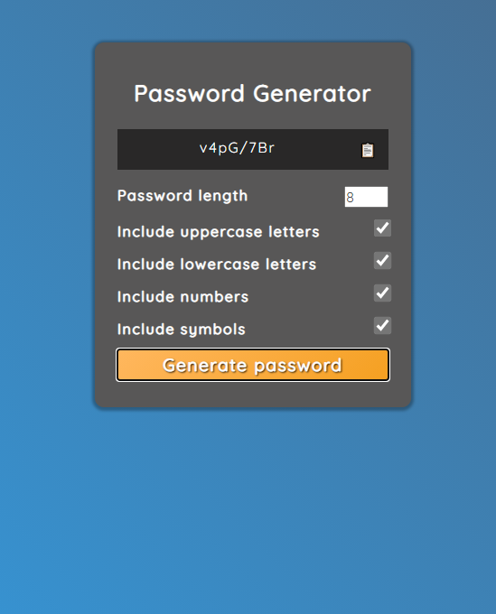

# PassGen - A password generator

A HTML5, CSS3, and vanilla JavaScript project to build a password generator which can produce a password with:

1. A length between 2 and 20 characters.
2. Option to include a mixture of uppercase characters, lowercase characters, numbers and symbols.
3. The ability to copy the generated password to the clipboard.

View live [here]()!

### Screenshot

